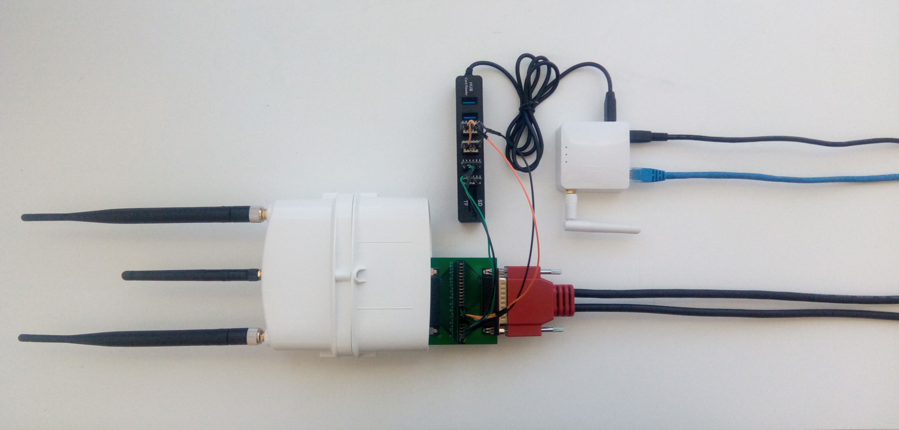
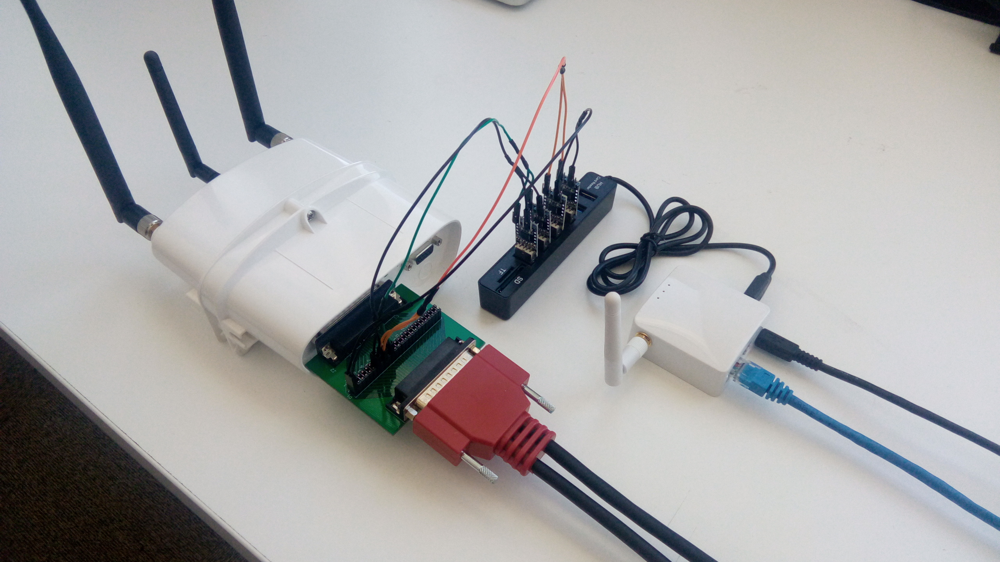

# Assembling and deploying a Mesh Observer
## Assembly
1. Follow the flashing instructions for your device: [GL-AR150](../firmware/ar150-flash-process.md), [GL-AR750](../firmware/ar750-flash-process.md), [DRAGINO2](../firmware/dragino-flash-process.md)
2. Construct a [UHF Breakout](uhf-breakout.md)
3. Connect the USB hub of the UHF breakout to your device

## Deployment
1. Disconnect the power cable from the Mesh Extender
2. Plug the UHF breakout into the Mesh Extender, then the power cable into the UHF breakout
3. Connect an Ethernet cable between the network (or your computer) and the Mesh Observer
4. Connect a micro-USB cable between a power supply and the Mesh Observer

The Mesh Extender and Observer will both begin booting. This will take a few minutes to complete.
Once the Mesh Observer has booted, it will begin accepting SSH connections at `192.168.1.1` with `root` as the username and password.
If the Mesh Observer is connected to a network with other devices, it is recommended that you [configure its Ethernet interface](../../mesh-extender/software/network-configuration.md) to use a different IP address than the default `192.168.1.1`, as it may cause conflicts.

The final product should look something like the images below:  
</img>
</img>