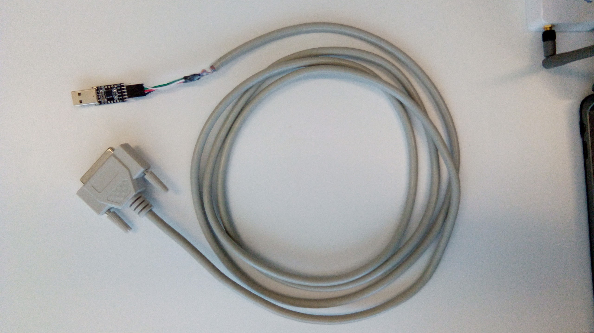
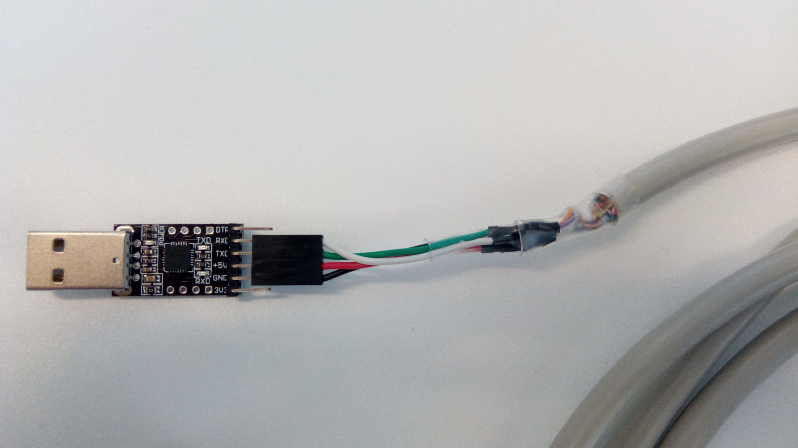

# Building a Mesh Extender Programming Cable
A Mesh Extender Programming Cable is a simple adaptor that breaks out the 5v and serial lines from the [standard power cable](http://developer.servalproject.org/dokuwiki/doku.php?id=content:meshextender:me2.0_standard_power_cable_pinout#proposed_pinout_for_mesh_extender_20_pcb_version_4_onwards) plug, making it easier to program Mesh Extenders.  

There are two types that we have used in the lab: one that uses a D-Sub breakout and a FTDI cable, and one that is custom-made to suit a USB-UART adaptor. Both types expose pins 1, 5, 19, and 22 of the Mesh Extender, as per the [standard power cable pinout](http://developer.servalproject.org/dokuwiki/doku.php?id=content:meshextender:me2.0_standard_power_cable_pinout#proposed_pinout_for_mesh_extender_20_pcb_version_4_onwards).

## FTDI and Breakout
### Required materials
- 1x FTDI-to-USB cable
- 1x 25-pin D-Sub breakout with a female connector

### Process
1. Connect the pins from the FTDI cable to the pins of the breakout as follows:
```
FTDI Cable        D-Sub Breakout
Red    (Vcc) ---> Pin 22 (5v)
Black  (GND) ---> Pin 1  (GND)
Orange (TXD) ---> Pin 19 (RX)
Yellow (RXD) ---> Pin 5  (TX)
```

The final cable should look similar to this:  
<!-- Using HTML because normal Markdown doesn't support parallel images -->
</img>
</img>

## USB-UART and Cable
### Required materials
- 1x Parallel/DB25 cable with a female plug
- 1x USB-UART adaptor
- 4x Female DuPont connectors with crimp pins, some wire, and heatshrink *OR* 2x Female-to-Female DuPont jumper wires
- 1x Multimeter for testing wire continuity

### Process
1. Cut the parallel cable in half and strip back the insulation to expose the 25 wires inside
2. Using the continuity tester, insert a probe into pin 1 of the parallel cable and, using the other probe, test each wire until you find circuit continuity. This will be the wire that corresponds to that pin
3. Note down the colour of the wire and the pin it corresponds to
4. Repeat steps 2 and 3 for the three remaining pins: 5, 19, and 22
5. Trim away the excess wires, leaving the four desired ones exposed with enough length to either crimp a pin onto, or solder onto a DuPont wire
6. Strip each wire and either crimp them to a DuPont pin or solder them to a DuPont wire and cover them in heatshrink
7. Connect each pin as follows:
```
USB-UART      D-Sub Breakout
5v       ---> Pin 22 (5v)
GND      ---> Pin 1  (GND)
TX       ---> Pin 19 (RX)
RX       ---> Pin 5  (TX)
```

The final cable should look similar to this:  
<!-- Using HTML because normal Markdown doesn't support parallel images -->
</img>
</img>
